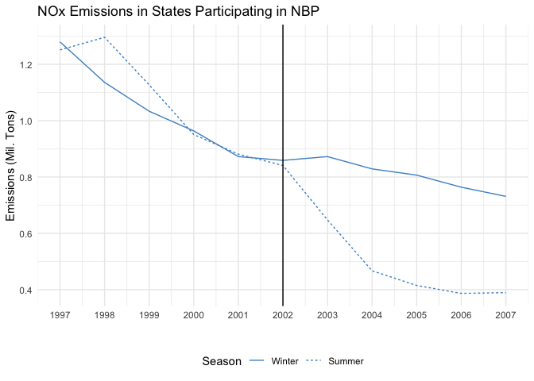
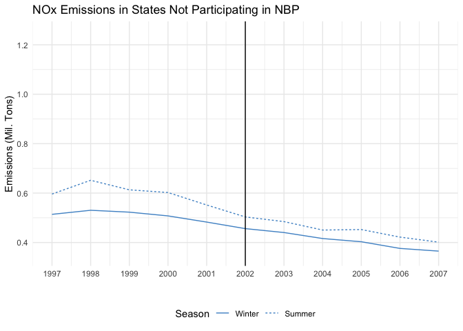

<!-- README.md is generated from README.Rmd. Please edit that file -->

# The Effect of the EPA’s NOx Budget Trading Program (NBP)

<!-- badges: start -->
<!-- badges: end -->

  I estimate the causal effect of the U.S. EPA’s NOx Budget Trading
Program (NBP) on air pollutant emissions. This project is a replication
of the 2017 paper *“Defensive investments and the demand for air
quality: Evidence from the NOx budget program.”* by Deschênes,
Greenstone and Shapiro (source and citation down below). Following the
paper’s methodology, I estimate the causal effects using a
difference-in-differences and triple difference approach

## What was the NBP pogram and what are the main variables in the data?

  The NOx Budget Trading program (NBP), operated a cap-and-trade system
for over 2,500 electricity generating units and industrial boilers in
Eastern and Midwestern states between 2003 and 2008. The emissions
market established by the program introduced three sources of emission
variation. The first source, captured by the variable `post`, was the
start of the program in 2003. The `nbp` dummy variable indicates if a
state was part of the NBP in the 2003-2008 period. Since the market
implemented by NBP only operated during the period between May 1 and
September 30, it offered a third source of variation which is captured
in the variable `summer`. In short, the program created an emissions
market from 2003 to 2008 in certain states, and this market only
operated during summer months.

## NOx emissions in states participating in NBP

<!-- -->

## Parallel Trends Assumption:

  The assumption underlying graph replicated above is that, absent of
treatment, NOx emissions in states subject to the NBP policy (i.e., the
treatment group) would follow the same trend as emissions in states not
subject to the program (i.e., the control group). The graphical pattern
in the graph suggests this assumption, commonly referred to as the
parallel trends assumption, would hold as emissions in both groups of
states follow the same downward trend and have similar NOx emission
levels prior to the program’s implementation.

## Diff-in-diff among states participating in NBP

  To run a difference-in-difference regression that examines the effect
of the NBP on NOx emissions among states that participated in the
program, we will use the the variable for emissions, `nox_emit`, as the
dependent variable. For the independent variables, we use the dummy
variables for whether it was the summer season (i.e., May 1 to September
30) and for whether the program had been implemented, as well as their
interaction. The specification is as follows:

    ## 
    ## <table style="text-align:center"><caption><strong>Diff-in-Diff: Effect of NBP on NOx Emissions among Participating States</strong></caption>
    ## <tr><td colspan="2" style="border-bottom: 1px solid black"></td></tr><tr><td style="text-align:left"></td><td><em>Dependent variable:</em></td></tr>
    ## <tr><td></td><td colspan="1" style="border-bottom: 1px solid black"></td></tr>
    ## <tr><td style="text-align:left"></td><td>NOx Emssions</td></tr>
    ## <tr><td colspan="2" style="border-bottom: 1px solid black"></td></tr><tr><td style="text-align:left">Summer</td><td>0.034</td></tr>
    ## <tr><td style="text-align:left"></td><td>(0.064)</td></tr>
    ## <tr><td style="text-align:left"></td><td></td></tr>
    ## <tr><td style="text-align:left">Post Implementation</td><td>-0.223***</td></tr>
    ## <tr><td style="text-align:left"></td><td>(0.059)</td></tr>
    ## <tr><td style="text-align:left"></td><td></td></tr>
    ## <tr><td style="text-align:left">Interaction</td><td>-0.373***</td></tr>
    ## <tr><td style="text-align:left"></td><td>(0.077)</td></tr>
    ## <tr><td style="text-align:left"></td><td></td></tr>
    ## <tr><td style="text-align:left">Constant</td><td>1.024***</td></tr>
    ## <tr><td style="text-align:left"></td><td>(0.045)</td></tr>
    ## <tr><td style="text-align:left"></td><td></td></tr>
    ## <tr><td colspan="2" style="border-bottom: 1px solid black"></td></tr><tr><td style="text-align:left">Observations</td><td>26,070</td></tr>
    ## <tr><td colspan="2" style="border-bottom: 1px solid black"></td></tr><tr><td style="text-align:left"><em>Note:</em></td><td style="text-align:right">*p<0.1; **p<0.05; ***p<0.01</td></tr>
    ## </table>

  The coefficient of the interaction of the variables `summer` and
`post` indicates the ‘difference-in-differences’ - that is to say the
difference between the difference of the means in the summer months
before and after the introduction of NBP and the difference of the
winter season means before and after NBP. Specifically, the coefficient
points to an average reduction of 373 thousand Tons in emissions during
the summer seasons after the rollover of the NOx Budget Trading program.

## NOx emissions in states not participating in NBP

<!-- -->

## Placebo Test

  The graph above may seem unintuitive, since I plot emissions in
non-participating states which we don’t assume will change with NBP’s
introduction. It’s objective, however, is to run a placebo test for the
parallel trends assumption previously discussed. The test allows us to
see if emissions follow the same trends in both the summer and winter
seasons when the program is not in place. If the placebo test shows
equal trends in both seasons with no changes after program starts among
these non-participating states, it supports the results that indicate
causal links between NBP and any changes within participating states.

## Diff-in-diff among non participating states

  To run a difference-in-difference regression that examines the effect
of the NBP on NOx emissions among non-participating states, we will
employ the same the specification as in the previous diff-in-diff
regression, only with data restricted to non-participating states this
time.

    ## 
    ## <table style="text-align:center"><caption><strong>Diff-in-Diff: Effect of NBP on NOx Emissions among Non-Participating States</strong></caption>
    ## <tr><td colspan="2" style="border-bottom: 1px solid black"></td></tr><tr><td style="text-align:left"></td><td><em>Dependent variable:</em></td></tr>
    ## <tr><td></td><td colspan="1" style="border-bottom: 1px solid black"></td></tr>
    ## <tr><td style="text-align:left"></td><td>NOx Emssions</td></tr>
    ## <tr><td colspan="2" style="border-bottom: 1px solid black"></td></tr><tr><td style="text-align:left">Summer</td><td>0.084**</td></tr>
    ## <tr><td style="text-align:left"></td><td>(0.035)</td></tr>
    ## <tr><td style="text-align:left"></td><td></td></tr>
    ## <tr><td style="text-align:left">Post Implementation</td><td>-0.102***</td></tr>
    ## <tr><td style="text-align:left"></td><td>(0.032)</td></tr>
    ## <tr><td style="text-align:left"></td><td></td></tr>
    ## <tr><td style="text-align:left">Interaction</td><td>-0.042</td></tr>
    ## <tr><td style="text-align:left"></td><td>(0.047)</td></tr>
    ## <tr><td style="text-align:left"></td><td></td></tr>
    ## <tr><td style="text-align:left">Constant</td><td>0.502***</td></tr>
    ## <tr><td style="text-align:left"></td><td>(0.024)</td></tr>
    ## <tr><td style="text-align:left"></td><td></td></tr>
    ## <tr><td colspan="2" style="border-bottom: 1px solid black"></td></tr><tr><td style="text-align:left">Observations</td><td>29,788</td></tr>
    ## <tr><td colspan="2" style="border-bottom: 1px solid black"></td></tr><tr><td style="text-align:left"><em>Note:</em></td><td style="text-align:right">*p<0.1; **p<0.05; ***p<0.01</td></tr>
    ## </table>

  The coefficient of the interaction term indicates that a 40 thousand
Ton fall in NOx emissions during the summer seasons among the
non-participating states is associated with the implementation of NBP;
however, this change is not statistically significant.

## Triple-difference regression

  To run a triple-difference regression that examines the effect of the
NOx Budget Trading program we will again use `nox_emit` as the dependent
variable and `nbp`, `summer` and `post` as the independent variables. We
will regress the outcome variable on each of the independent variables,
the pair interactions of `nbp` and`summer`, `nbp` and `post`, and `nbp`
and `summer` as well as the triple interaction of all three. The
specification is as follows:

    ## 
    ## <table style="text-align:center"><caption><strong>Diff-in-Diff: Effect of NBP on NOx Emissions among Non-Participating States</strong></caption>
    ## <tr><td colspan="2" style="border-bottom: 1px solid black"></td></tr><tr><td style="text-align:left"></td><td><em>Dependent variable:</em></td></tr>
    ## <tr><td></td><td colspan="1" style="border-bottom: 1px solid black"></td></tr>
    ## <tr><td style="text-align:left"></td><td>NOx Emssions</td></tr>
    ## <tr><td colspan="2" style="border-bottom: 1px solid black"></td></tr><tr><td style="text-align:left">NBP Participation</td><td>0.522***</td></tr>
    ## <tr><td style="text-align:left"></td><td></td></tr>
    ## <tr><td style="text-align:left"></td><td></td></tr>
    ## <tr><td style="text-align:left">Post Implementation</td><td>-0.102***</td></tr>
    ## <tr><td style="text-align:left"></td><td>(0.032)</td></tr>
    ## <tr><td style="text-align:left"></td><td></td></tr>
    ## <tr><td style="text-align:left">Summer</td><td>0.084*</td></tr>
    ## <tr><td style="text-align:left"></td><td>(0.035)</td></tr>
    ## <tr><td style="text-align:left"></td><td></td></tr>
    ## <tr><td style="text-align:left">NBP*Post</td><td>-0.121</td></tr>
    ## <tr><td style="text-align:left"></td><td></td></tr>
    ## <tr><td style="text-align:left"></td><td></td></tr>
    ## <tr><td style="text-align:left">Post*Summer</td><td>-0.042</td></tr>
    ## <tr><td style="text-align:left"></td><td></td></tr>
    ## <tr><td style="text-align:left"></td><td></td></tr>
    ## <tr><td style="text-align:left">NBP*Summer</td><td>-0.050</td></tr>
    ## <tr><td style="text-align:left"></td><td></td></tr>
    ## <tr><td style="text-align:left"></td><td></td></tr>
    ## <tr><td style="text-align:left">Triple Interaction</td><td>-0.331</td></tr>
    ## <tr><td style="text-align:left"></td><td></td></tr>
    ## <tr><td style="text-align:left"></td><td></td></tr>
    ## <tr><td style="text-align:left">Constant</td><td>0.502***</td></tr>
    ## <tr><td style="text-align:left"></td><td>(0.024)</td></tr>
    ## <tr><td style="text-align:left"></td><td></td></tr>
    ## <tr><td colspan="2" style="border-bottom: 1px solid black"></td></tr><tr><td style="text-align:left">Observations</td><td>55,858</td></tr>
    ## <tr><td colspan="2" style="border-bottom: 1px solid black"></td></tr><tr><td style="text-align:left"><em>Note:</em></td><td style="text-align:right">*p<0.1; **p<0.05; ***p<0.01</td></tr>
    ## </table>

  The coefficient of the triple interaction term indicates there was
approximately a 33% decrease in NOx emissions during the summer season
among states that participated in the program. This coefficient is the
difference between the two coefficients discussed previously - i.e., the
coefficients for the interaction terms of the participating states
diff-in-diff and the non-participating states diff-in-diff.

## Overview of Results:

  The NOx Budget Trading Program established a cap-and-trade market on
NOx emissions throughout counties of certain states, predominantly in
the eastern United States, during the 2003 to 2007 period. Within this
time frame, the policy was specifically in place during a ‘summer’
season that lasted from May until the end of September. A
difference-in-differences regression of participating states, showed
that after NBP’s implementation there was a reduction of over 370
thousand Tons in the average NOx emissions during the summer season.
When implementing a triple-difference approach, where we account for the
changes in the average emissions in non-participating states, we found a
smaller reduction but nevertheless an impactful one. Specifically, the
results indicated that NBP lead to a 330,000 Ton reduction, on average,
per year of NOx emissions during the summer seasons. Globally,
throughout the four and half years of NBP’s implementation (mid 2003
until 2008) it reduced close ro 1.5 million Tons of NOx emissions.

## Source:

[Deschênes, Olivier, Michael Greenstone, and Joseph S. Shapiro.
“Defensive investments and the \| \| demand for air quality: Evidence
from the NOx budget program.” American Economic Review 107, no. \| 10
(2017):
2958-89](http://joseph-s-shapiro.com/research/NOx_Defenses_DGS.pdf)
